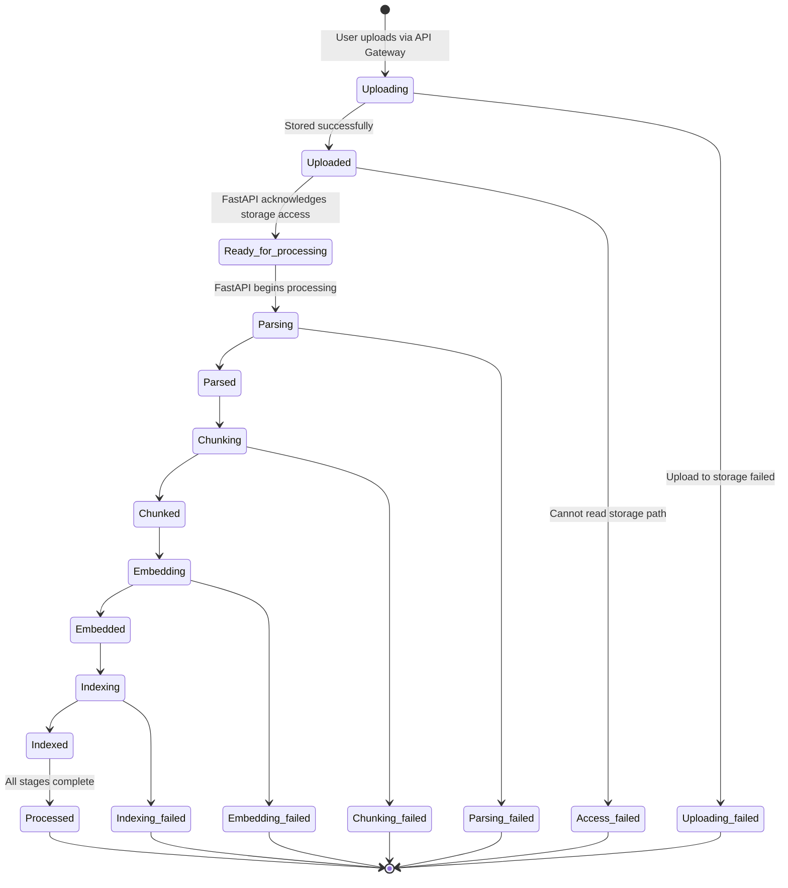

# Document Processing Status Flow

| | |
| --- | --- |
| **Repository** | generalized-rag-pipeline |
| **Components** | API Gateway · AI Service |
| **States** | 18 internal · 3 public |
| **Date** | 23 August 2026 |

The lifecycle of a document as it moves through the API Gateway (Orchestrator) and the FastAPI (AI Service). Every processing stage is tracked separately so a failure can be attributed to the exact step that broke.

## State Definitions

### Upload - driven by Orchestrator
- **`UPLOADING`** - The document is being uploaded to the storage path (Local, AWS S3, Azure Blob, GCP, etc).
- **`UPLOADED`** - The document has been successfully received by the Orchestrator and written to the storage path.
- **`UPLOADING_FAILED`** - The document upload to the storage path failed.

### Handoff - driven by AI Service
- **`READY_FOR_PROCESSING`** - The FastAPI service has acknowledged the document and is able to access it at the storage path.
- **`ACCESS_FAILED`** - The document is uploaded, but the AI Service cannot access it at the storage path.

### Processing - driven by AI Service
| Stage | In progress | Completed | Failed |
| --- | --- | --- | --- |
| Parsing | `PARSING` | `PARSED` | `PARSING_FAILED` |
| Chunking | `CHUNKING` | `CHUNKED` | `CHUNKING_FAILED` |
| Embedding | `EMBEDDING` | `EMBEDDED` | `EMBEDDING_FAILED` |
| Indexing | `INDEXING` | `INDEXED` | `INDEXING_FAILED` |

### Terminal
- **`PROCESSED`** - The document is fully processed: parsed, chunked, embedded and indexed.

## Flow Diagram

> All status changes are written by the Orchestrator. The AI Service never updates status directly - it reports progress to the status-update endpoint and the Orchestrator performs the write.



## User-Visible Statuses

The eighteen states above are internal. The user is only ever shown three statuses; every internal state collapses into one of them.

| User sees | Meaning | Internal states |
| --- | --- | --- |
| `UPLOADED` | The document is in the pipeline and still being worked on. | `UPLOADING`, `UPLOADED`, `READY_FOR_PROCESSING`, `PARSING`, `PARSED`, `CHUNKING`, `CHUNKED`, `EMBEDDING`, `EMBEDDED`, `INDEXING`, `INDEXED` |
| `PROCESSED` | The document is fully processed and ready to be queried. | `PROCESSED` |
| `FAILED` | Processing stopped at some stage; the exact stage stays internal. | `UPLOADING_FAILED`, `ACCESS_FAILED`, `PARSING_FAILED`, `CHUNKING_FAILED`, `EMBEDDING_FAILED`, `INDEXING_FAILED` |

`UPLOADED` and `PROCESSED` are both internal states and user-facing statuses; `FAILED` exists only as a user-facing status. All four accessors live on the one enum:

| Method | Returns | Purpose |
| --- | --- | --- |
| `toUserVisibleStatus()` | `DocumentStatus` | The user-visible status for this internal one. |
| `getUserVisibleStatuses()` | `List<DocumentStatus>` | The 3 statuses a user can see. |
| `getInternalStatuses()` | `List<DocumentStatus>` | The 18 statuses the pipeline records. |
| `getAllStatuses()` | `List<DocumentStatus>` | All 19 constants. |

## Appendix - DocumentStatus.java

`api-gateway/src/main/java/com/genrag/document/api/DocumentStatus.java`

```java
package com.genrag.document.api;

import java.util.Arrays;
import java.util.EnumSet;
import java.util.List;
import java.util.Set;

/**
 * Lifecycle of a document moving through the API Gateway (Orchestrator) and
 * the FastAPI (AI Service). Eighteen statuses drive the pipeline; three are
 * also the only ones ever shown to a user. UPLOADED and PROCESSED serve both
 * roles, FAILED is user-facing only.
 *
 * <p>The Orchestrator is the only writer of this status. The AI Service never
 * updates it directly; it reports progress to the status-update endpoint and
 * the Orchestrator performs the write.
 */
public enum DocumentStatus {

    UPLOADING, UPLOADED, UPLOADING_FAILED,
    READY_FOR_PROCESSING, ACCESS_FAILED,
    PARSING, PARSED, PARSING_FAILED,
    CHUNKING, CHUNKED, CHUNKING_FAILED,
    EMBEDDING, EMBEDDED, EMBEDDING_FAILED,
    INDEXING, INDEXED, INDEXING_FAILED,
    PROCESSED,

    /** Roll-up only: shown to users, never recorded by the pipeline. */
    FAILED;

    /** Statuses that exist only for the user, never as a pipeline state. */
    private static final Set<DocumentStatus> USER_VISIBLE_ONLY = EnumSet.of(FAILED);

    /**
     * Single source of truth for the internal -> user-visible projection.
     * Exhaustive on purpose: a new constant will not compile until mapped.
     *
     * @return the status a user should be shown for this internal status
     */
    public DocumentStatus toUserVisibleStatus() {
        return switch (this) {
            case UPLOADING, UPLOADED, READY_FOR_PROCESSING,
                 PARSING, PARSED, CHUNKING, CHUNKED,
                 EMBEDDING, EMBEDDED, INDEXING, INDEXED -> UPLOADED;
            case PROCESSED                              -> PROCESSED;
            case UPLOADING_FAILED, ACCESS_FAILED, PARSING_FAILED,
                 CHUNKING_FAILED, EMBEDDING_FAILED,
                 INDEXING_FAILED, FAILED                -> FAILED;
        };
    }

    /**
     * The three statuses a user can see, derived from the projection above so
     * the two can never disagree. Sorted into declaration order, which is the
     * lifecycle order UPLOADED -> PROCESSED -> FAILED.
     *
     * @return the user-visible statuses
     */
    public static List<DocumentStatus> getUserVisibleStatuses() {
        return Arrays.stream(values())
                .map(DocumentStatus::toUserVisibleStatus)
                .distinct()
                .sorted()
                .toList();
    }

    /**
     * The eighteen statuses the pipeline can actually record.
     *
     * @return the statuses that may be persisted against a document
     */
    public static List<DocumentStatus> getInternalStatuses() {
        return Arrays.stream(values())
                .filter(status -> !USER_VISIBLE_ONLY.contains(status))
                .toList();
    }

    /**
     * Every constant in this enum.
     *
     * @return all statuses, internal and user-visible alike
     */
    public static List<DocumentStatus> getAllStatuses() {
        return List.of(values());
    }
}
```
